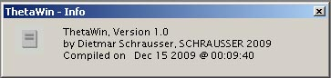
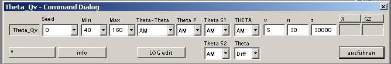
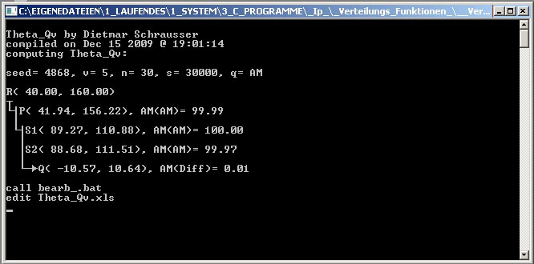
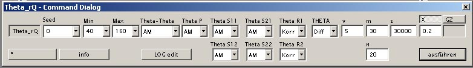
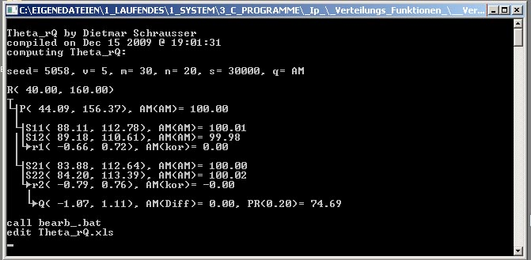
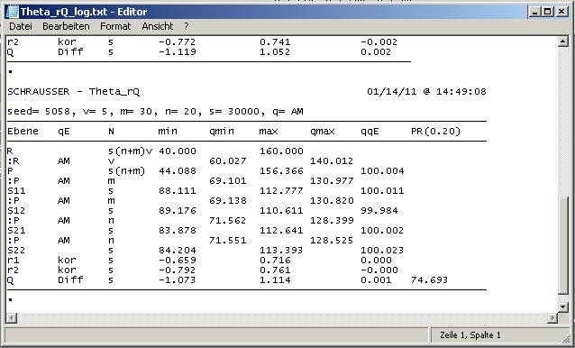

# ThetaWin

Graphical user interface for *Theta*  applications (Schrausser, 2009) within `ConsoleApp_DistributionFunctions` (Schrausser, 2023),
generating distributions and estimators for several parameters $\theta$ via *bootstrap* method, with given number of resamples $B$, where bootstrap estimator

$$\hat\theta_B=B^{-1}⋅\sum_{i=1}^B\theta^*_i.$$

### Screenshots

## Theta

    Usage: Theta [sd] [min] [max] [qq] [q] [v] [s] [[x]] [[g]]
     [sd]  ........... Seed: |0| Zeitwert
     [min] ........... R Minimalwert
     [max] ........... R Maximalwert
     [qq]  ........... Theta-Theta/
     [q]   ........... Theta:
                       |0| Harmonisches Mittel (HM)
                       |1| Arithmetisches Mittel (AM)
                       |2| Summe (SUM)
                       |3| Standardabweichung (SD)
                       |4| Populationsvarianzschaetzung (VAR)
                       |5| Produktsumme(PSM)
                       |6| Geometrisches Mittel(GM)
                       |7| Schrausser's d (D)
                       |8| DvarO (DV)
     [v]  ...........  n zu Theta (v)
     [s]  ...........  n Subpopulationen (s)
     [x]  ...........  Vergleichswert x
     [g]  ...........  |1| Wertebereich ganzzahlig

## Theta Q

    Usage: Theta_Q [sd][min][max][qq][qp][qs1][qs2][qQ][v][m][n][s] [[x]] [[g]]
     [sd]  ........................... Seed: |0| Zeitwert
     [min] ........................... R Minimalwert
     [max] ........................... R Maximalwert
     [qq]  ........................... Theta-Theta/
     [qp]  ........................... Theta P/
     [qs1] [qs2] ..................... Theta S1, S2:
                                       |0| Harmonisches Mittel (HM)
                                       |1| Arithmetisches Mittel (AM)
                                       |2| Summe (SUM)
                                       |3| Standardabweichung (SD)
                                       |4| Populationsvarianzschaetzung (VAR)
                                       |5| Produktsumme(PSM)
                                       |6| Geometrisches Mittel(GM)
                                       |7| Schrausser's d (D)
                                       |8| DvarO (DV)
     [qQ]  ........................... Theta Q:
                                       |1| Differenz
                                       |2| Quotient
                                       |3| Summe
                                       |4| Produkt
     [v]  ...........................  n zu Theta P (v)
     [m]  ...........................  n zu Theta S1 (m)
     [n]  ...........................  n zu Theta S2 (n)
     [s]  ...........................  n Subpopulationen (s)
     [x]  ...........................  Vergleichswert x
     [g]  ...........................  |1| Wertebereich ganzzahlig

## Theta Qv

    Usage: Theta_Qv [sd][min][max][qq][qp][qs1][qs2][qQ][QQ][v][n][s] [[x]] [[g]]
     [sd]  ........................... Seed: |0| Zeitwert
     [min] ........................... R Minimalwert
     [max] ........................... R Maximalwert
     [qq]  ........................... Theta-Theta/
     [qp]  ........................... Theta P/
     [qs1][qs2]....................... Theta S1, S2/
     [qQ]  ........................... Theta Q:
                                       |0| Harmonisches Mittel (HM)
                                       |1| Arithmetisches Mittel (AM)
                                       |2| Summe (SUM)
                                       |3| Standardabweichung (SD)
                                       |4| Populationsvarianzschaetzung (VAR)
                                       |5| Produktsumme(PSM)
                                       |6| Geometrisches Mittel(GM)
                                       |7| Schrausser's d (D)
                                       |8| DvarO (DV)
     [QQ]  ........................... Theta Theta Q:
                                       |1| Differenz
                                       |2| Quotient
                                       |3| Summe
                                       |4| Produkt
                                       |5| Korrelation
                                       |6| Kovarianz
                                       |7| Determinationskoeffizient
                                       |8| Redundanz
     [v]  ...........................  n zu Theta P (v)
     [n]  ...........................  n zu Theta S1,S2 (n)
     [s]  ...........................  n Subpopulationen (s)
     [x]  ...........................  Vergleichswert x
     [g]  ...........................  |1| Wertebereich ganzzahlig

## Theta rQ

    Usage: Theta_rQ [sd][min][max][qq][qp][q11][q12][q21][q22][qr1][qr2][qQ][v][m][n][s] [[x]] [[g]]
     [sd]  ....................... Seed: |0| Zeitwert
     [min] ....................... R Minimalwert
     [max] ....................... R Maximalwert
     [qq]  ....................... Theta-Theta/
     [qp]  ....................... Theta P/
     [q11][q12] .................. Theta S11, S12/
     [q21][q22] .................. Theta S21, S22:
                                   |0| Harmonisches Mittel (HM)
                                   |1| Arithmetisches Mittel (AM)
                                   |2| Summe (SUM)
                                   |3| Standardabweichung (SD)
                                   |4| Populationsvarianzschaetzung (VAR)
                                   |5| Produktsumme(PSM)
                                   |6| Geometrisches Mittel(GM)
                                   |7| Schrausser's d (D)
                                   |8| DvarO (DV)
     [qr1][qr2] ...................Theta Regressionen 1,2/
                                   |1| Korrelation (kor)
                                   |2| Kovarianz (cov)
                                   |3| Determinatinskoeffizient (det)
                                   |4| Redundanz (red)
     [qQ]  ....................... Theta Q:
                                   |1| Differenz (Diff)
                                   |2| Quotient (Quot)
                                   |3| Summe (Summ)
                                   |4| Produkt (Prod)
     [v]  .......................  n zu Theta P (v)
     [m]  .......................  n zu Theta S11,S12 (m)
     [n]  .......................  n zu Theta S21,S22 (n)
     [s]  .......................  n Subpopulationen (s)
     [x]  .......................  Vergleichswert x
     [g]  .......................  |1| Wertebereich ganzzahlig

## Theta S

    Usage: Theta_S [sd] [min] [max] [qq] [qp] [qs] [v] [m] [s] [[x]] [[g]]
     [sd]  ...................... Seed: |0| Zeitwert
     [min] ...................... R Minimalwert
     [max] ...................... R Maximalwert
     [qq]  ...................... Theta-Theta:
     [qp]  ...................... Theta P/
     [qs]  ...................... Theta S/
                                  |0| Harmonisches Mittel (HM)
                                  |1| Arithmetisches Mittel (AM)
                                  |2| Summe (SUM)
                                  |3| Standardabweichung (SD)
                                  |4| Populationsvarianzschaetzung (VAR)
                                  |5| Produktsumme(PSM)
                                  |6| Geometrisches Mittel(GM)
                                  |7| Schrausser's d (D)
                                  |8| DvarO (DV)
      [v]  .....................  n zu Theta P (v)
      [m]  .....................  n zu Theta S (m)
      [s]  .....................  n Subpopulationen (s)
      [x]  .....................  Vergleichswert x
      [g]  .....................  |1| Wertebereich ganzzahlig

## References

Schrausser, D. G. (2009). *ThetaWin: Overview*. https://www.academia.edu/81800920

———. (2023). *Schrausser/ConsoleApp_DistributionFunctions: Console applicationes for distribution functions* (v1.0.0). Zenodo. https://doi.org/10.5281/zenodo.7664141
